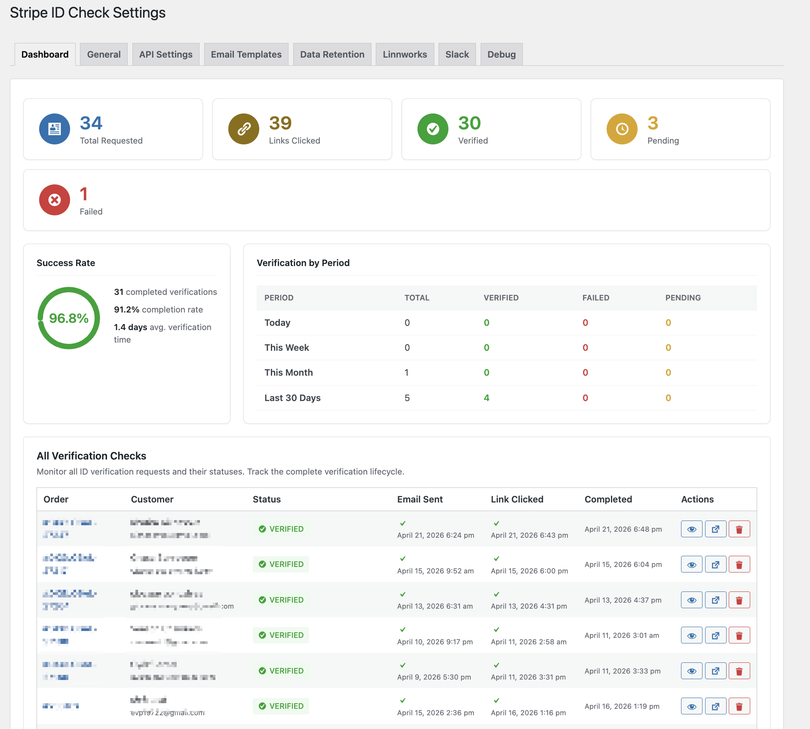
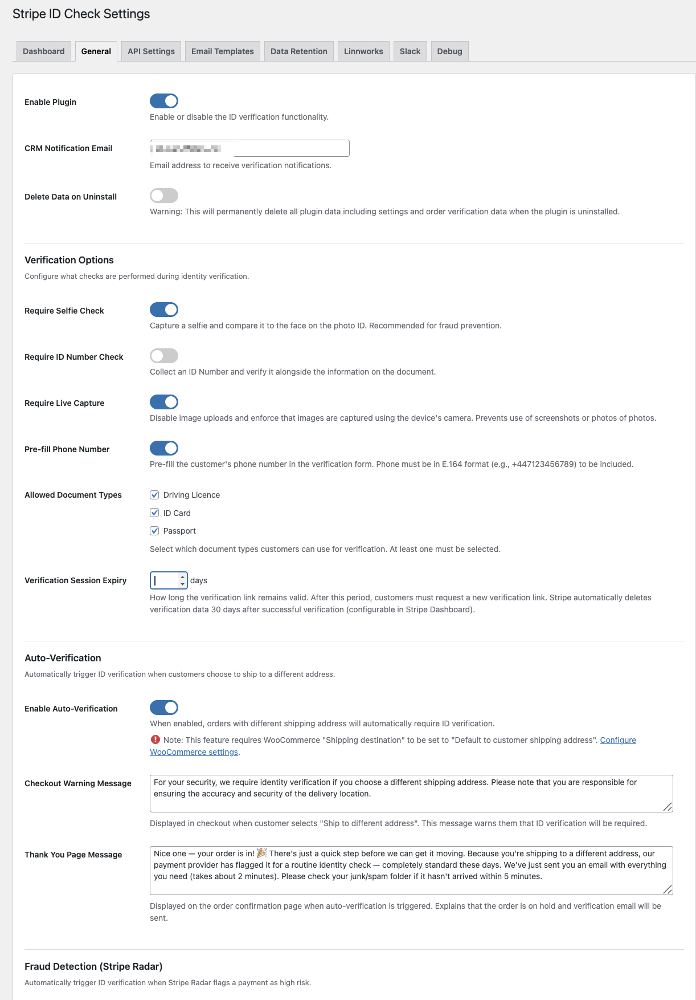
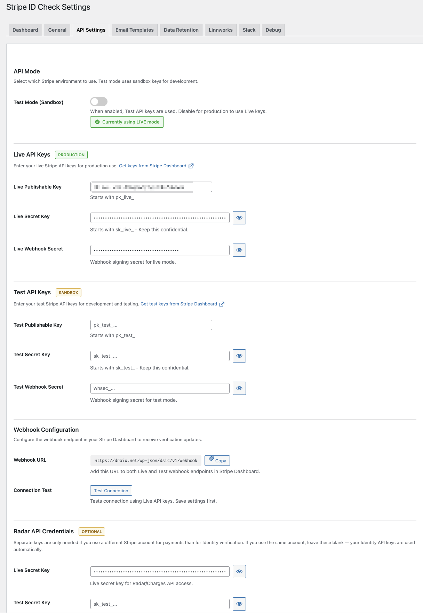
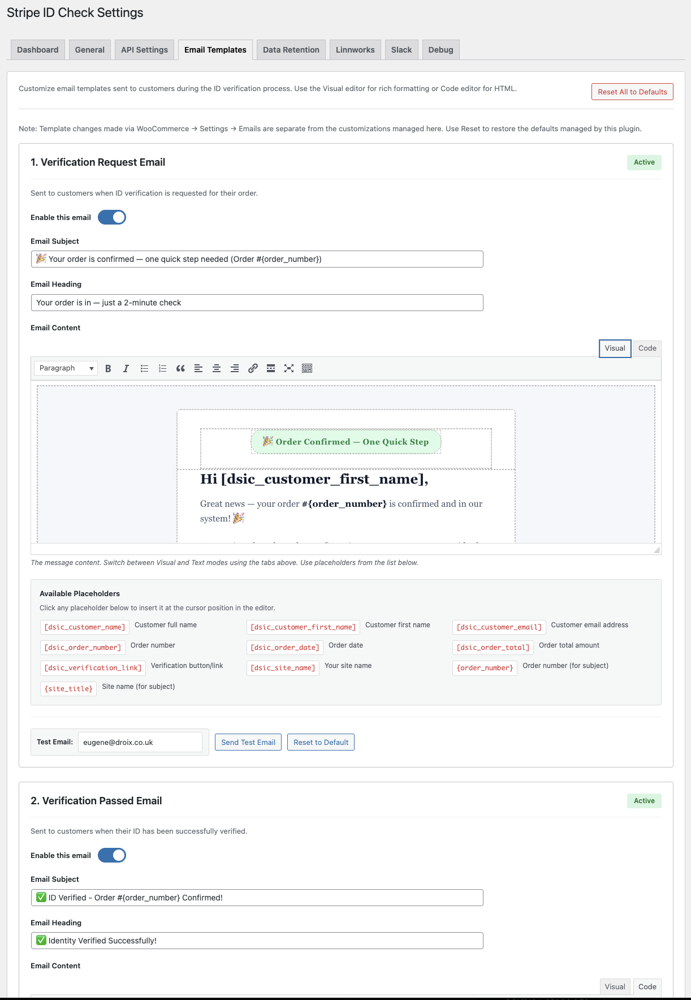
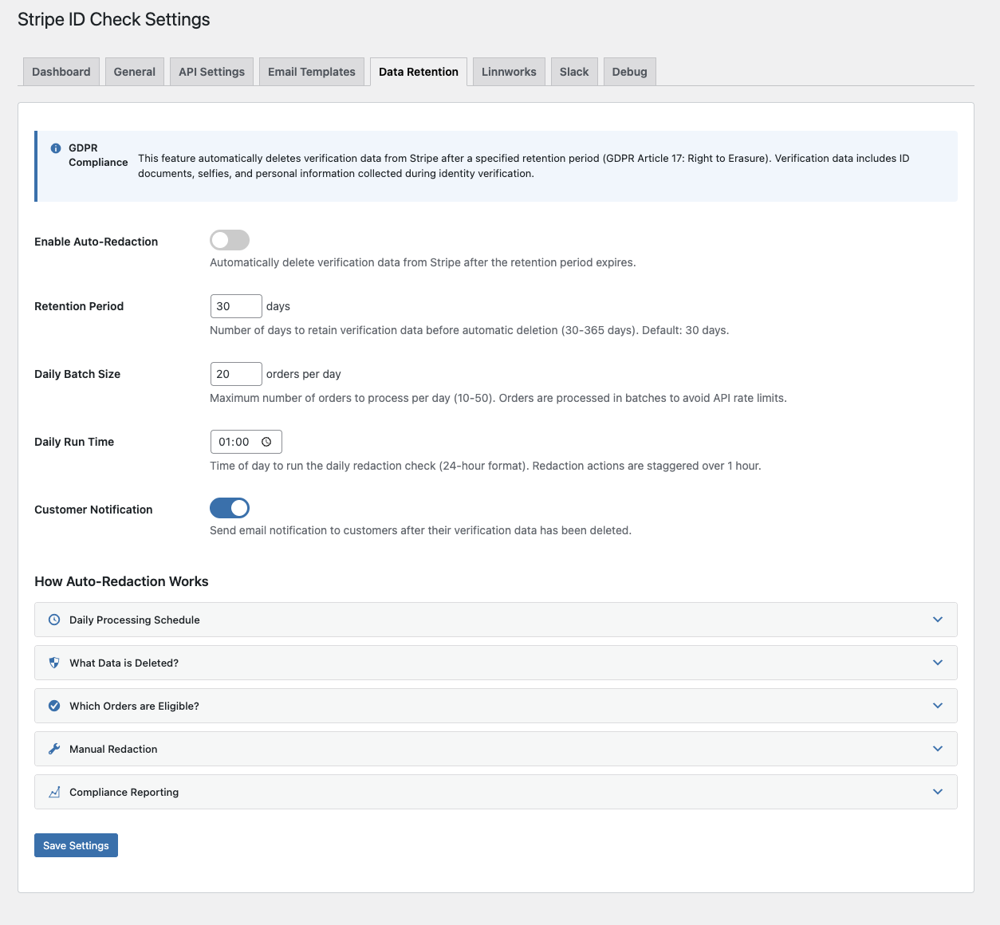
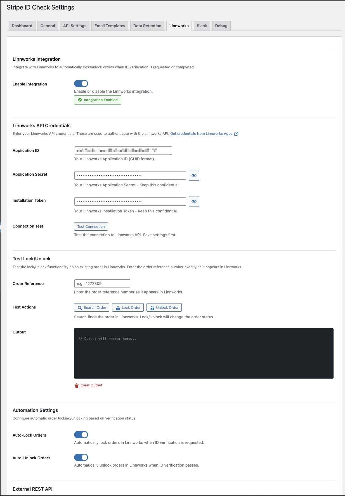
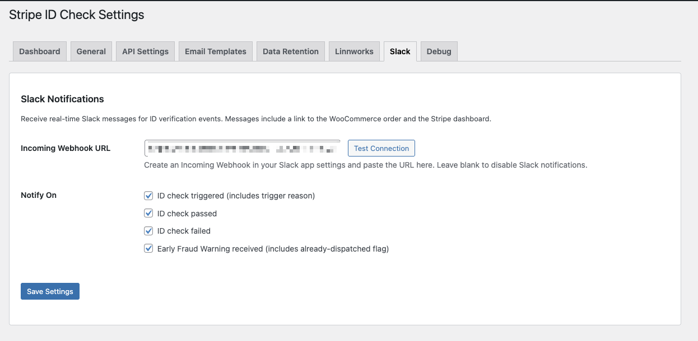
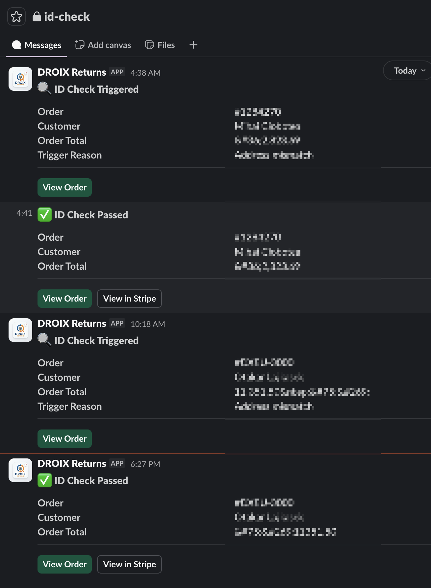
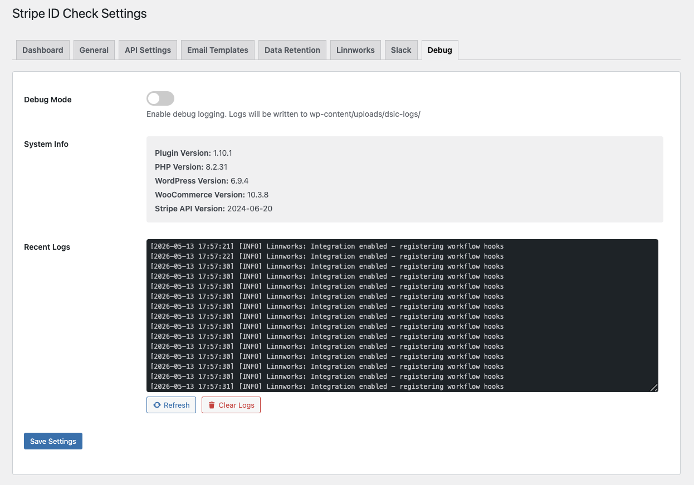

# Stripe ID Check for WooCommerce

Stripe ID Check adds Stripe Identity verification to WooCommerce so high-risk orders can be reviewed without building a custom KYC workflow.

DROIX built this plugin after dealing with scam attempts against high-value handheld gaming device orders. The goal is simple: keep genuine customers moving, put risky orders on hold, and give store operators a clear audit trail before dispatch.

## Why Use It

- Request ID checks directly from WooCommerce orders.
- Automatically require verification for genuinely different billing and shipping addresses.
- Trigger checks from Stripe Radar risk signals, Early Fraud Warnings, or order amount thresholds.
- Hold orders while verification is pending, then move verified orders forward.
- Send customer and CRM emails using editable templates.
- Keep sensitive ID documents and selfies inside Stripe Identity rather than your WordPress uploads.
- Optionally lock and unlock Linnworks orders while verification is pending.
- Optionally send Slack alerts for verification events.
- Redact Stripe Identity verification data after your configured retention period.

## What You Need

For the core verification flow, you only need:

- WordPress 6.4 or later
- WooCommerce 8.0 or later
- PHP 8.0 or later
- Your own Stripe account with Identity enabled
- HTTPS so Stripe can deliver webhooks to your store

You do not need DROIX credentials, a separate KYC vendor account, or a custom verification app. Optional integrations such as Linnworks and Slack only need credentials if you choose to enable those features.

## Cost

The plugin is free and released under GPLv2 or later. Stripe Identity usage is billed by Stripe to your own Stripe account.

Stripe pricing is localized and can change, so check the current Stripe Identity pricing page for your account region before rollout:

- UK example as of 2026-05-13: Stripe lists ID document + selfie verification at GBP 1.25 per completed verification, with the first 50 verifications free.
- US example as of 2026-05-13: Stripe lists ID document + selfie verification at US $1.50 per completed verification, with the first 50 verifications free.
- ID number lookup is a separate Stripe Identity charge if you enable that verification method.

See Stripe's current pages for details: [Stripe Identity UK](https://stripe.com/gb/identity) and [Stripe Identity US](https://stripe.com/us/identity).

## Workflow

1. Configure the plugin with your Stripe API keys and webhook signing secret.
2. Choose which orders should require identity verification.
3. The plugin places matching orders on hold and sends the customer a secure Stripe Identity link.
4. The customer completes verification through Stripe's hosted flow.
5. Stripe webhooks update WooCommerce with the verification result.
6. WooCommerce order status, emails, logs, and optional Linnworks or Slack actions update automatically.

## Screenshots

### Verification Dashboard

Track total requests, link clicks, pass rate, pending checks, failed checks, and the full verification history from one admin dashboard.

### General Verification Rules

Configure document requirements, selfie checks, live capture, phone pre-fill, address-mismatch auto-verification, checkout warning copy, and thank-you page messaging.

### Stripe API And Webhooks

Use separate live and test API keys, copy the webhook endpoint, test the connection, and optionally provide separate Radar credentials.

### Customer Email Templates

Edit request, passed, failed, CRM, and data-redaction emails with a visual editor, placeholders, test sends, and reset-to-default controls.

### Data Retention

Configure automatic Stripe Identity data redaction, daily batch size, run time, customer notification, and compliance-reporting behavior.

### Linnworks Integration

Lock orders while checks are pending, unlock them when verification passes, test credentials, and expose a header-authenticated REST API for external workflows.

### Slack Notifications

Send internal alerts for triggered, passed, failed, and Early Fraud Warning events using your own Slack incoming webhook.

### Slack Message Feed

Review ID check events in Slack with order, customer, total, trigger reason, and direct links back to WooCommerce or Stripe.

### Debug Tools

View environment details and recent plugin logs when diagnosing integration or webhook issues.

## Feature Highlights

- Manual verification requests from the WooCommerce order screen.
- Bulk order actions for requesting, resending, or cancelling verification.
- Checkout auto-verification when shipping and billing addresses are materially different.
- Stripe Radar risk-level, risk-score, and Early Fraud Warning support.
- Optional order amount threshold trigger.
- Customer-facing My Account verification status panel.
- Editable email templates with shortcodes and WPML/Polylang support.
- WooCommerce HPOS compatibility.
- GDPR-oriented data retention and redaction tooling.
- Audit logs for verification, compliance, and Linnworks activity.

## Setup

1. Install the plugin in `wp-content/plugins/droix-stripe-id-check`.
2. Activate it in WordPress.
3. Open **ID Check** or **DROIX Plugins -> Stripe ID Check** in wp-admin.
4. Add your own Stripe test and live API keys.
5. Configure the webhook endpoint shown in the plugin settings.
6. Subscribe to the required Stripe Identity webhook events:
   - `identity.verification_session.verified`
   - `identity.verification_session.requires_input`
   - `identity.verification_session.canceled`
   - `identity.verification_session.redacted`
7. Enter the webhook signing secret in the plugin settings.
8. Use **Test Connection** before enabling the workflow for live orders.

Optional: enable Radar triggers, amount thresholds, Slack notifications, data redaction, and Linnworks order locking after the core Stripe Identity flow is working.

## Security And Privacy

This repository does not include DROIX API keys, Stripe credentials, Linnworks credentials, Slack webhooks, customer data, or internal business data. Each merchant must configure their own credentials in WordPress.

The plugin sends customer name, email, phone when enabled, and order metadata to Stripe Identity so Stripe can perform verification. Government ID documents and selfies are handled by Stripe; they are not stored by this plugin. The plugin can request Stripe data redaction after a configurable retention period.

Admin logs and notifications may include order metadata. Review your own retention, access controls, and privacy obligations before enabling debug logging, CRM emails, Slack notifications, or external REST API access.

## License

This plugin is released under GPLv2 or later.

We are sharing it for free because fraud-prevention tooling should be more accessible to ecommerce teams. If it helps your store, we would appreciate optional support through the marketplaces linked from [DROIX.store](https://DROIX.store).
